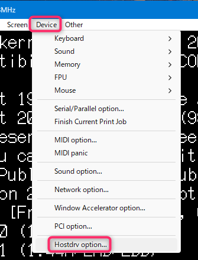
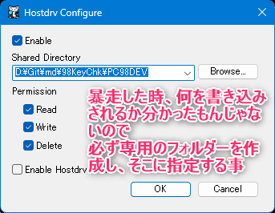

# tools
作成に当たり、使うツール類を置く場所

## np21w
エミュレータ「Neko Project 21/W ver.0.86 rev.103」置き場
以下はホストOS側の内容となる

### FreeDOS(98)
「Neko Project 21/W」でHDDイメージファイルを作成<br>
「Emulate」→ 「New disk」→「Hard disk image…」で作成できる

先ほど作ったHDDイメージを「Neko Project 21/W」にマウントする<br>
※パーティション作られてないので当然見えない

「FreeDOS(98)起動フロッピーディスクイメージ」<br>
でFreeDOS(98)を起動する

HDDのフォーマットは`FORMAT`コマンドではなく`BTNPART`コマンドで行う

フォーマット後、
システムの転送は`SYS`コマンドで行う

```
SYS C:
```

※Aがフロッピードライブ1、Bがフロッピードライブ2、Cが先ほどフォーマットしたHDD

### FILMTN
ファイラー「FILMTN」を導入

```
A:\FILMTN
```

のパスを通す

```
PATH=A:\;A:\FILMTN;A:\LSIC86\BIN
```

### LSIC86
LSI C-86 v3.30c 試食版

丸っと展開した物を「LSI86」フォルダとして置く

#### LSIC86 - AUTOEXEC.BAT
AUTOEXEC.BATで

```
A:\LSIC86\BIN
```

のパスを通す

```
PATH=A:\;A:\FILMTN;A:\LSIC86\BIN
```

#### LSIC86 - CONFIG.SYS
CONFIG.SYSのFILESを20以上にする

```
FILES=20
```

#### LSIC86 - _LLC
_LCC のファイルの内容を変更する

```
A:\LSIC86\BIN\_LCC
```

をエディタで開き

```
-XA:\LSIC86\BIN -LA:\LSIC86\LIB -IA:\LSIC86\INCLUDE -T -O
```

を

```
-XA:\LSIC86\BIN -LA:\LSIC86\LIB -IA:\LSIC86\INCLUDE -T -O -j
```

に変更する(後ろに -j を付けた)<br>
これで、エラーが日本語で表示される

### HOSTDRV.COM
あらかじめ「Neko Project 21/W」側で、対象のフォルダーを設定します

ここで設定したフォルダーの内容が、ゲストOSのHドライブとして見える様になります





AUTOEXEC.BATで

```
LH HOSTDRV.COM H
```

(メインメモリ消費節約のため、先頭にLHを書いてUMB領域に置く様にしている)<br>
HOSTDRV.COM の機能によりホストOSのHドライブとして、先ほど設定したフォルダの内容が見える様になります

### CONFIG.SYS 最終
```
DOS=HIGH,UMB
DOSDATA=UMB

BUFFERS=6
FILES=20
LASTDRIVE=Z

DEVICE=HIMEMX.EXE
DEVICE=EMM386.EXE RAM FRAME=C000
```

### AUTOEXEC.BAT 最終
```
@echo off
set TZ=JST-9
set LANG=JA
LH HOSTDRV.COM H

PATH=A:\;A:\FILMTN;A:\LSIC86\BIN
```
